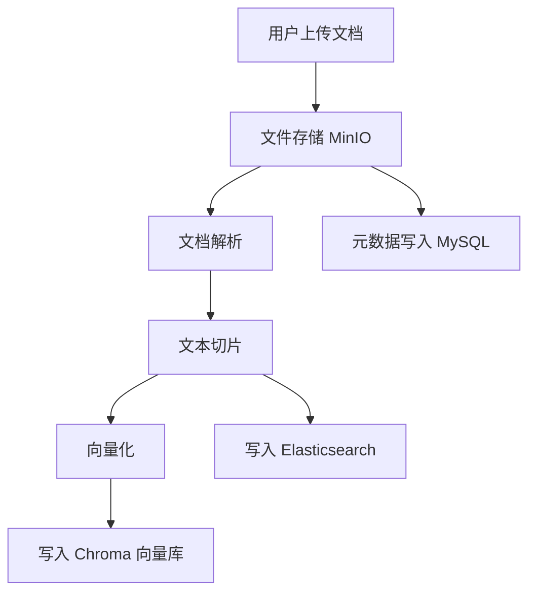
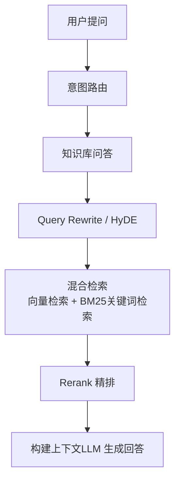

### 项目简介
OmniSeek 是一个基于知识库场景的智能问答与检索系统，采用 前后端分离架构 ，结合 WebSocket 实时对话、意图路由、混合检索（向量 + BM25）、Query Rewrite、HyDE、Rerank 等能力，实现从用户问题到高质量答案生成的完整闭环。

核心能力包括：

- 知识库文档上传、解析、切片、向量化
- 基于权限控制的知识检索
- WebSocket 实时问答
- 意图识别与多路由分发
- 混合检索、查询改写、HyDE、Rerank 精排
- MCP 工具调用（Web 搜索 / SQL 查询 / 知识库统计）
- 会话管理、滑动窗口式压缩与历史归档

### 技术栈
- 后端 ：Spring Boot、Spring WebSocket、Spring Security
- 数据库 ：MySQL、Redis
- 对象存储 ：MinIO
- 消息队列 ：Kafka
- 检索引擎 ：Elasticsearch、Chroma
- AI 能力 ：
  - LLM：DeepSeek / SiliconFlow
  - Embedding：DashScope Embedding
  - Rerank：Qwen Rerank
- 能力增强 ：
  - Query Rewrite
  - HyDE
  - 混合检索（Vector + BM25）
  - RRF 融合
  - 权限过滤
  - MCP 工具调用

### 核心功能

#### 文档入库

#### 知识库问答

